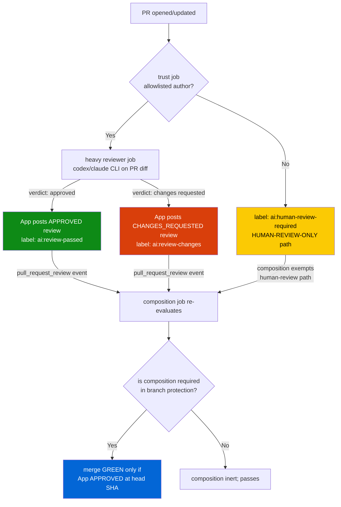

# Architecture — `aidoc-flow-ci`

How the pieces fit together. This doc covers the reusable-workflow
model, the shared workflows + what each does, the trust + verdict
flow that ties `ai-review` and `composition` together, the per-repo
policy surfaces consumers configure, and **the multi-repo + multi-project
architecture** (`aidoc-flow-ci` as the company-wide CI library;
per-project governance lives in each project's own repo).

For consumer-facing intro + install, see [`../README.md`](../README.md).
For onboarding a new company project, see
[`multi-project-guide.md`](multi-project-guide.md). For label
conventions, see [`../LABELS.md`](../LABELS.md). For override
patterns, see [`overrides.md`](overrides.md). For security model,
see [`security.md`](security.md). For runner-pool setup, see
[`runners.md`](runners.md).

## 0. The two-repo architecture (library vs project-governance)

**`aidoc-flow-ci` is the company-wide CI library.** It hosts the
reusable workflows, scripts, install templates, and shared CI assets
(reviewer rubric + verdict schema, future shared skills). Every
project + every consumer repo uses it via `uses: vladm3105/aidoc-flow-ci/...@ci/vX.Y.Z`.

**Each PROJECT (aidoc-flow, future trading, etc.) has its OWN
governance repo.** Operations (`aidoc-flow-operations`) is the
governance home for the aidoc-flow project: IPLANs, DECISIONS log,
HANDOFF, inbox runbooks, ROADMAP, OKRs. Future projects get their
own equivalent.

**Each CONSUMER repo (operations, framework, business, iplanic,
future projects' consumers) has its OWN per-repo config** —
`.github/ai-review/config.json` (trust allowlist, vendor choice,
auto-merge eligibility) + `.github/docs-sync.json` + optional
overrides via `.github/ai-review/review-prompt.md` (per-consumer
rubric) etc.

| Layer | Where | Scope | Examples |
|---|---|---|---|
| **CI library** | `aidoc-flow-ci` | Single source-of-truth across the company | Reusable workflows; install templates; shared rubric; verdict schema; scripts; docs |
| **Project governance** | Per project (`aidoc-flow-operations` for aidoc-flow; future projects get their own) | One per company project | IPLANs, DECISIONS log, HANDOFF, inbox runbooks, ROADMAP, OKRs |
| **Consumer repo** | Each repo that runs CI (operations, framework, business, etc.) | One per repo | Caller workflow files; per-repo `config.json`; optional asset overrides |

Per [IPLAN-0017-CHARTER §1](https://github.com/vladm3105/aidoc-flow-operations/blob/main/ops/iplans/IPLAN-0017-CHARTER_aidoc-flow-ci.md#1-purpose),
this repo is "A single source-of-truth repo for CI infrastructure
shared across the aidoc-flow workspace **and all future company
projects**." See [`multi-project-guide.md`](multi-project-guide.md)
for the onboarding flow when a new company project adopts.

## 1. The reusable-workflow model

`aidoc-flow-ci` ships **reusable workflows** — GitHub Actions
workflows with `on: workflow_call:`, called from consumer repos via
`uses: vladm3105/aidoc-flow-ci/.github/workflows/<name>.yml@ci/vX.Y.Z`.

Per [GitHub's reusable-workflows
docs](https://docs.github.com/en/actions/sharing-automations/reusing-workflows):

- The consumer caller is a normal workflow file with `on:` triggers
  (e.g., `pull_request`, `push`, `schedule`).
- The caller's job invokes the reusable workflow via `uses:` and
  optionally passes `with:` inputs + `secrets: inherit`.
- The called workflow runs in the **consumer's repo context**
  (`github.repository`, `github.event.pull_request.*`, etc. resolve
  to the caller's PR).
- Pinning is by **tag** (semver `ci/vX.Y.Z`) or SHA; the consumer's
  `.github/workflows/<name>.yml` file is what GitHub actually runs.

## 2. The 9 shared workflows

| Workflow | File | What it does | Triggers (typical caller) |
|---|---|---|---|
| `ai-review` | [`.github/workflows/ai-review.yml`](../.github/workflows/ai-review.yml) | AI-reviewer gate — trust check → reviewer App → post verdict + apply state label | `pull_request_target`, `pull_request_review` |
| `composition` | [`.github/workflows/composition.yml`](../.github/workflows/composition.yml) | App-approval status check — required for merge; fires GREEN only when a counting reviewer-App approval exists at the current head SHA | `pull_request_review [submitted, dismissed, edited]`, `workflow_run` [completed] (from ai-review). v1.3.0+ install default — `pull_request_target` overrideable per [`overrides.md`](overrides.md). |
| `docs-sync` | [`.github/workflows/docs-sync.yml`](../.github/workflows/docs-sync.yml) | **Mechanical** post-merge doc fixer (CHANGELOG stub-entry + version propagation + cross-ref repair). Per IPLAN-0018. Direct-commits to main with `[skip ci]`. **Deprecated by `doc-maintainer` at end of IPLAN-0025 Phase 3 (ci/v2.0.0).** | `push: branches: [main]` |
| `doc-maintainer` | [`.github/workflows/doc-maintainer.yml`](../.github/workflows/doc-maintainer.yml) | **AI-driven** post-merge doc-of-record maintainer (CHANGELOG / HANDOFF / ROADMAP / IPLAN status / DECISIONS narrative-grade edits). Per IPLAN-0025. Reads merge diff + conventions doc + decides scope via LLM; opens follow-up bot PR for low-risk edits (auto-merges through ai-review chain) AND/OR GitHub issue for high-risk edits (human applies). Available v1.4.0+; supersedes mechanical `docs-sync` at end of Phase 3. | `push: branches: [main]`, `schedule [cron '7,37 * * * *']` (backup reconciler) |
| `labeler` | [`.github/workflows/labeler.yml`](../.github/workflows/labeler.yml) | Path-based PR area labeling via `actions/labeler@v6` | `pull_request` |
| `codeql` | [`.github/workflows/codeql.yml`](../.github/workflows/codeql.yml) | CodeQL security analysis (matrix-driven explicit languages) | `push`, `pull_request`, weekly `schedule`, `workflow_dispatch` |
| `markdown-lint` | [`.github/workflows/markdown-lint.yml`](../.github/workflows/markdown-lint.yml) | Markdown linting via `markdownlint-cli2-action` (inline PR annotations) | `pull_request`, `push` |
| `links` | [`.github/workflows/links.yml`](../.github/workflows/links.yml) | Link checking via `lychee-action` — `internal` mode is PR-blocking; `external` mode is cron + non-blocking | `pull_request`, weekly `schedule` |
| `secret-scan` | [`.github/workflows/secret-scan.yml`](../.github/workflows/secret-scan.yml) | Secret detection via `gacts/gitleaks` (MIT — NOT proprietary `gitleaks/gitleaks-action`) | `pull_request`, `push` |

Each workflow is independently callable. Consumers pick the subset
they want and call them from their own `.github/workflows/`.

## 3. The trust + verdict flow (ai-review + composition)

`ai-review` and `composition` work together to enforce
"merge only when the reviewer App has approved the current head".
This is the most intricate part of the design.



Key points:

1. **Trust gate is the security boundary.** Untrusted authors
   (forks; not in `trust.ai_review` allowlist) never reach the heavy
   reviewer. See [`security.md`](security.md) for the threat model.
2. **App identity, not personal-account identity.** The reviewer is
   a GitHub App that submits APPROVED reviews; composition counts
   the App's `bot-user numeric id` (login is spoofable). This is
   why composition is the required check, not "approval count ≥ 1".
3. **`pull_request_review` re-triggers composition.** When the App
   submits APPROVED, that event fires composition again — flipping
   it from RED to GREEN without re-running the heavy reviewer.
4. **`skip-ai-review` label carries forward.** Per
   [`../LABELS.md`](../LABELS.md) §1, a human can apply
   `skip-ai-review` to suppress further reviewer runs; composition
   passes the prior approval forward on subsequent pushes.

## 4. Per-repo policy surfaces

Each consumer repo carries small per-repo config files that the
shared workflows read. Consumers customize these without forking
the shared workflows.

| File | Read by | Purpose |
|---|---|---|
| `.github/ai-review/config.json` | `ai-review` (trust job) + `composition` (trust gate) | Trust allowlists (`trust.ai_review` / `trust.auto_fix`); governance locked paths; auto-merge eligibility |
| `.github/labeler.yml` | `labeler` | Path → label map for area labels |
| `.markdownlint.json` (or `.markdownlint-cli2.*`) | `markdown-lint` | Markdownlint rule overrides |
| `.lychee.toml` | `links` | Link-checker config (cache, accept codes, excludes) |
| `.gitleaks.toml` | `secret-scan` | Custom rules + allowlist (optional; default ruleset suffices) |
| `.github/codeql/codeql-config.yml` | `codeql` (optional) | paths-ignore / custom queries |

Starter versions of each ship at `install/templates/`:
[`config.json.template`](../install/templates/config.json.template),
[`labeler.yml`](../install/templates/labeler.yml),
[`.markdownlint.json`](../install/templates/.markdownlint.json),
[`.lychee.toml`](../install/templates/.lychee.toml),
[`.gitleaks.toml`](../install/templates/.gitleaks.toml).

## 5. Inputs that vary per consumer

The reusable workflows expose `with:` inputs for the values that
genuinely differ across consumers — primarily runner labels and
visibility-driven choices. See [`overrides.md`](overrides.md) for
the override patterns.

Common inputs across workflows:

- `runner_labels` (or `runner_labels_routine` / `runner_labels_review`
  for `ai-review`): default `"ubuntu-latest"`; PRIVATE consumers
  override to `"runner-self"` per
  [`../LABELS.md`](../LABELS.md) §2 routing rule
- `reviewer` (`ai-review` only): `codex` | `claude` (default config)
- `config-file` / `config-path`: pointer to the per-repo policy file

Inputs do NOT vary the workflow shape — only knob values. The
workflow body is identical across consumers.

## 6. Versioning + tag scheme

`aidoc-flow-ci` ships independent semver tags `ci/vX.Y.Z`,
decoupled from any consumer repo's spec/release semver. See
[`../CHANGELOG.md`](../CHANGELOG.md) for the per-tag changelog.

Consumers pin to a specific tag in their caller `uses:` line:

```yaml
uses: vladm3105/aidoc-flow-ci/.github/workflows/ai-review.yml@ci/v1.0.0
```

Pinning to `@main` is **not recommended** — every push to
`aidoc-flow-ci/main` would silently change consumer behavior. Always
pin to a release tag.

## 7. Local-overrides-shared (the foundational rule)

GitHub Actions runs whatever's in the consumer repo's
`.github/workflows/*.yml`. A shared workflow only runs when the
consumer explicitly calls it via `uses:`. So **local always wins**
— by GitHub's default, not by engineering. Three override modes
documented in [`overrides.md`](overrides.md): parameter override,
full replacement, add a custom workflow.

## 8. Drift detection (warning-only)

[`sync/check-drift.sh`](../sync/check-drift.sh) (run as a consumer
pre-commit hook or periodic GitHub Action) compares each consumer's
`.github/workflows/*.yml` against the canonical templates at the
pinned `ci/vX.Y.Z` tag and reports any diff as a `::warning::`.
**Never blocks the commit or the PR.** Contributor sees the
divergence and decides — bring back to canonical, intentionally
keep, or push the divergence upstream as a new shared default.

## 9. Where the design rationale lives

This doc covers WHAT each workflow does + HOW they fit together.
The deeper WHY (decision history, alternatives considered, rollout
sequence) lives in operations:

- [`aidoc-flow-operations/ops/iplans/IPLAN-0017_unified-ci-flows.md`](https://github.com/vladm3105/aidoc-flow-operations/blob/main/ops/iplans/IPLAN-0017_unified-ci-flows.md)
  — full plan, claim ledger, revision log
- [`aidoc-flow-operations/ops/iplans/IPLAN-0017-CHARTER_aidoc-flow-ci.md`](https://github.com/vladm3105/aidoc-flow-operations/blob/main/ops/iplans/IPLAN-0017-CHARTER_aidoc-flow-ci.md)
  — charter: why a separate repo, ownership, versioning
- [`aidoc-flow-operations/ops/DECISIONS.md`](https://github.com/vladm3105/aidoc-flow-operations/blob/main/ops/DECISIONS.md)
  — `OPS-0049` (no GitHub-hosted minutes for private),
  `OPS-0060` (consume from aidoc-flow-ci),
  `OPS-0061` (governance PR discipline)
